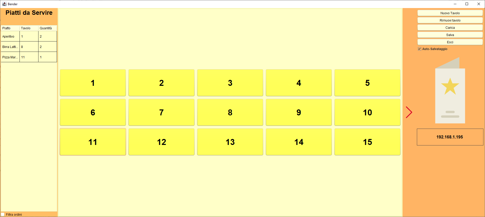
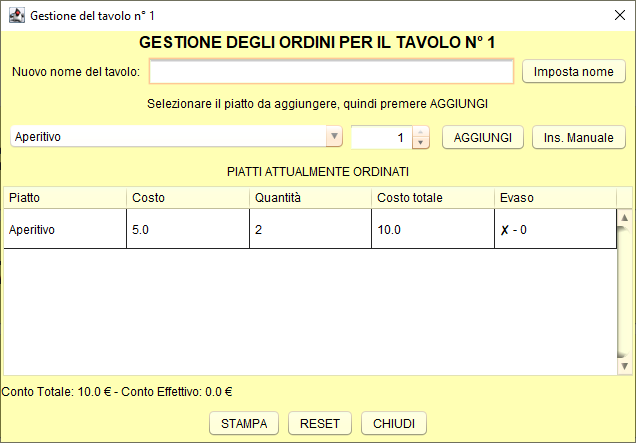

# Bender - Gestionale per bar


Bender è un gestionale per bar gratuito e open source. 

Le funzionalità fornite sono le seguenti:

* Gestione degli ordini per ciascun tavolo del bar
* Inserimento ordini da un menu preimpostato e/o manualmente
* Assegnamento di un nome ad un tavolo
* Inserimento di prenotazioni future
* Stampa dei conti (su carta semplice)
* **Interazione con [Bender Mobile](https://github.com/gscaparrotti/BenderMobile) per la gestione degli ordini da smartphone e tablet Android**

## Download

È possibile scaricare Bender da [qui](https://github.com/gscaparrotti/Bender/releases). In generale, si consiglia di scaricare la versione più recente.

È necessario avere Java installato sul proprio PC. Se non si dispone di un'installazione di Java, si consiglia di partire da [qui](https://openjdk.java.net/) o da [qui](https://www.java.com/it/download/).

## Utilizzo 
L'utilizzo di Bender è semplice e intuitivo. Di seguito è mostrata l'interfaccia grafica:



Nella parte sinistra sono mostrati gli ordini ancora da evadere, al centro sono mostrati i tavoli e a destra sono presenti alcuni pulsanti funzione.
Premendo col tasto sinistro del mouse su un ordine da evadere lo si indica come evaso. Mettendo il segno di spunta su `Filtra ordini`, tra i piatti da servire
non verranno mostrati quelli evidenziati come da filtrare nel menu (nel menu preimpostato si tratta delle bevande).

Di default, Bender salva su file ogni modifica fatta agli ordini. Per disabilitare questo comportamento, è necessario rimuovere la spunta ad `Auto-salvataggio`. È anche possibile riprendere da dove si aveva lasciato premendo il tasto `Carica`. 

#### Gestione tavoli

Premendo su un tavolo si apre la seguente schermata: 



È possibile assegnare un nome ad un tavolo. Ciò ha una duplice funzione: da un lato un nome permette di identificare un tavolo più facilmente, dall'altro consente di inserire delle prenotazioni future: gli ordini sono infatti associati non al solo tavolo, ma al tavolo con un dato numero e un dato nome: inserendo il nome di un cliente che prenota un tavolo è possibile pre-inserire le sue ordinazioni, per poi rimettere il nome del cliente corrente e "nascondere" le ordinazioni future. 
Per mostrare tutti gli ordini a prescindere dal cliente a cui sono associati è sufficiente rimuovere il nome del tavolo. 

Al di sotto è presente un menu a tendina che mostra tutti i piatti presenti nel menu e un pulsante `Ins. Manuale` con cui inserire un piatto manualmente. 

Al centro sono presenti la lista degli ordini del tavolo e il conto. Premendo col tasto sinistro del mouse su un ordine lo si indica come evaso, mentre premendo col tasto destro lo si elimina. 

Col tasto `Reset` si eliminano TUTTI gli ordini del tavolo. 

#### Inserimento menu

Per inserire un menu personalizzato è necessario creare un file chiamato `menu.txt` da inserire nella cartella `data` accanto al file `Bender-redist-x.y.z.jar`.

```
.
+-- Bender-redist-x.y.z.jar
+-- data
|   +-- menu.txt
```

Ogni riga all'interno del file `menu.txt` deve essere così composta: 

```
Nome piatto -- Prezzo -- Valore filtro (0 o 1)
```

Ad esempio: 

```
Bibita in Lattina -- 2.5 -- 0
Piadina -- 3.0 -- 1
```

I piatti il cui valore del filtro è `0` sono quelli che vengono nascosti dall'elenco dei piatti da servire quando si mette la spunta a `Filtra ordini`.

## Bug, nuove funzionalità e domande

Per queste questioni, si consiglia di scrivere [qui](https://github.com/gscaparrotti/Bender/issues).